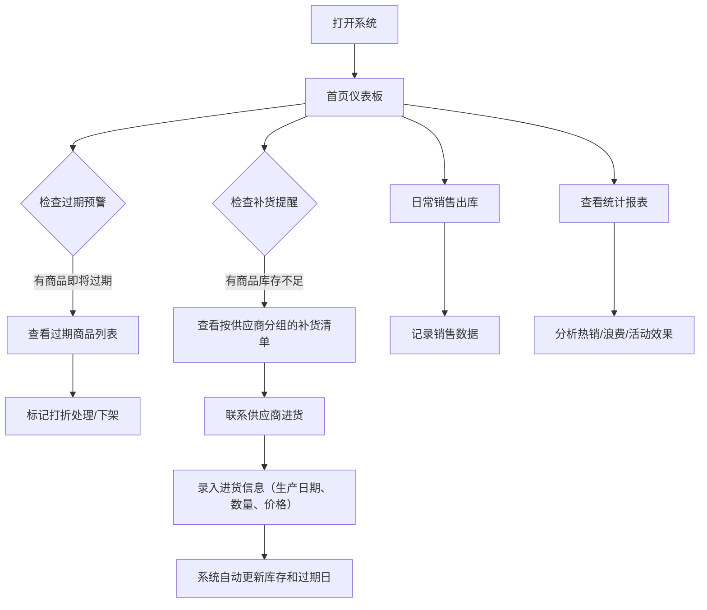

## 1. 产品概述

便利店商品保质期管理与自动补货提醒系统，专为小型便利店设计，帮助店主高效管理商品库存、保质期预警、智能补货提醒，降低过期损耗，提升经营效率。

- **核心价值**：通过数字化管理减少商品过期浪费，优化库存周转，降低经营成本
- **目标用户**：小型便利店店主、超市经营者
- **核心功能**：保质期预警、库存补货提醒、销售统计分析、供应商管理、促销活动追踪

## 2. 核心功能

### 2.1 用户角色

| 角色 | 登录方式 | 核心权限 |
|------|----------|----------|
| 店主 | 本地数据无需登录 | 全部功能权限，包括商品管理、库存操作、数据统计 |

### 2.2 功能模块

1. **首页仪表板**：今日概览、过期预警、补货提醒、快捷操作
2. **商品管理**：商品列表、新增/编辑商品、分类管理
3. **保质期管理**：生产日期录入、自动计算过期日、3天内过期商品提醒
4. **库存与补货**：库存阈值设置、低库存自动提醒、按供应商分组补货清单
5. **销售统计**：月度热销排行、过期浪费统计、销售趋势图表
6. **促销活动**：活动创建、买一送一等规则设置、活动效果分析
7. **供应商管理**：供应商信息、联系电话、历史进货价记录

### 2.3 页面详情

| 页面名称 | 模块名称 | 功能描述 |
|----------|----------|----------|
| 首页仪表板 | 概览卡片 | 显示今日到期、3天内过期、待补货商品数量统计 |
| 首页仪表板 | 过期预警列表 | 高亮显示未来3天即将过期的商品，支持一键标记处理 |
| 首页仪表板 | 补货提醒列表 | 显示低于库存阈值的商品，按供应商分组展示 |
| 商品管理 | 商品列表 | 展示所有商品，支持按分类、库存、保质期筛选 |
| 商品管理 | 商品表单 | 录入商品名称、分类、保质期天数、库存阈值、供应商 |
| 库存管理 | 入库操作 | 记录进货数量、生产日期、进货价、供应商 |
| 库存管理 | 出库操作 | 记录销售数量、支持扫码或手动录入 |
| 统计报表 | 热销排行 | 本月销量Top10商品柱状图 |
| 统计报表 | 浪费分析 | 过期商品金额统计、分类占比饼图 |
| 统计报表 | 活动分析 | 促销期间销量对比、增量百分比展示 |
| 供应商管理 | 供应商列表 | 显示供应商名称、电话、最近一次进货价 |
| 供应商管理 | 供应商表单 | 维护供应商联系方式、主营品类 |
| 促销管理 | 活动列表 | 展示进行中/已结束的促销活动 |
| 促销管理 | 活动创建 | 设置活动时间、买赠规则、活动商品 |

## 3. 核心流程

## 4. 用户界面设计

### 4.1 设计风格
- **主色调**：温暖橙色系（#FF7A00），传达便利店的活力和亲切感
- **辅助色**：绿色（#10B981）表示库存正常，黄色（#F59E0B）表示库存预警，红色（#EF4444）表示过期警告
- **中性色**：深灰（#1F2937）文本，浅灰（#F9FAFB）背景，白色卡片
- **按钮风格**：圆角8px，主按钮渐变橙色，悬停有轻微上浮和阴影
- **字体**：标题使用 "Noto Sans SC" 黑体，正文使用清晰易读的无衬线字体
- **布局**：左侧导航栏 + 右侧内容区，卡片式布局，清晰的信息层级
- **图标风格**：使用简洁的线性图标，配合颜色编码快速识别状态

### 4.2 页面设计概述

| 页面名称 | 模块名称 | UI 元素 |
|----------|----------|----------|
| 首页仪表板 | 概览卡片 | 4张统计卡片，不同背景色区分，数字大号字体，带趋势小箭头 |
| 首页仪表板 | 过期预警 | 红色警示边框，倒计时天数徽章，可展开显示详细批次 |
| 首页仪表板 | 补货提醒 | 黄色警示边框，供应商分组折叠面板，一键生成订货单 |
| 商品管理 | 商品列表 | 表格视图，支持分类标签筛选，每行显示库存状态色标 |
| 库存管理 | 入库表单 | 步进器选择数量，日期选择器选生产日期，自动计算过期日 |
| 统计报表 | 数据可视化 | 柱状图+饼图组合，支持月度切换，hover显示详情 |
| 供应商管理 | 供应商卡片 | 名片式设计，电话可点击拨打，最近进货价高亮显示 |
| 促销管理 | 活动卡片 | 活动倒计时，买赠规则标签，销量对比进度条 |

### 4.3 响应式设计
- **桌面端优先**：优化1280px及以上分辨率，左侧固定导航240px宽度
- **平板适配**：导航栏可折叠，表格支持横向滚动
- **移动适配**：底部Tab导航，卡片堆叠布局，优化触控区域
- **触控优化**：按钮最小高度44px，重要操作有确认弹窗

### 4.4 交互与动画
- **页面加载**：卡片依次淡入，带0.1s错开延迟
- **数据更新**：库存数字变化时有平滑过渡动画
- **预警提示**：过期/补货图标有轻微呼吸灯效果
- **表单反馈**：提交成功后绿色对勾动画，输入错误时抖动提示
- **悬停效果**：卡片悬浮时轻微上浮+阴影加深，表格行高亮
