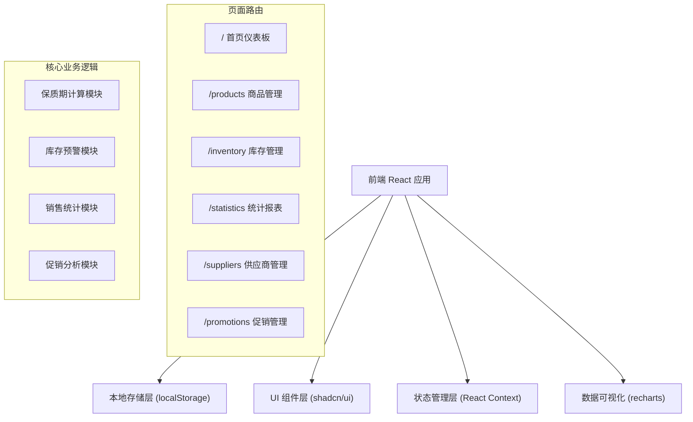
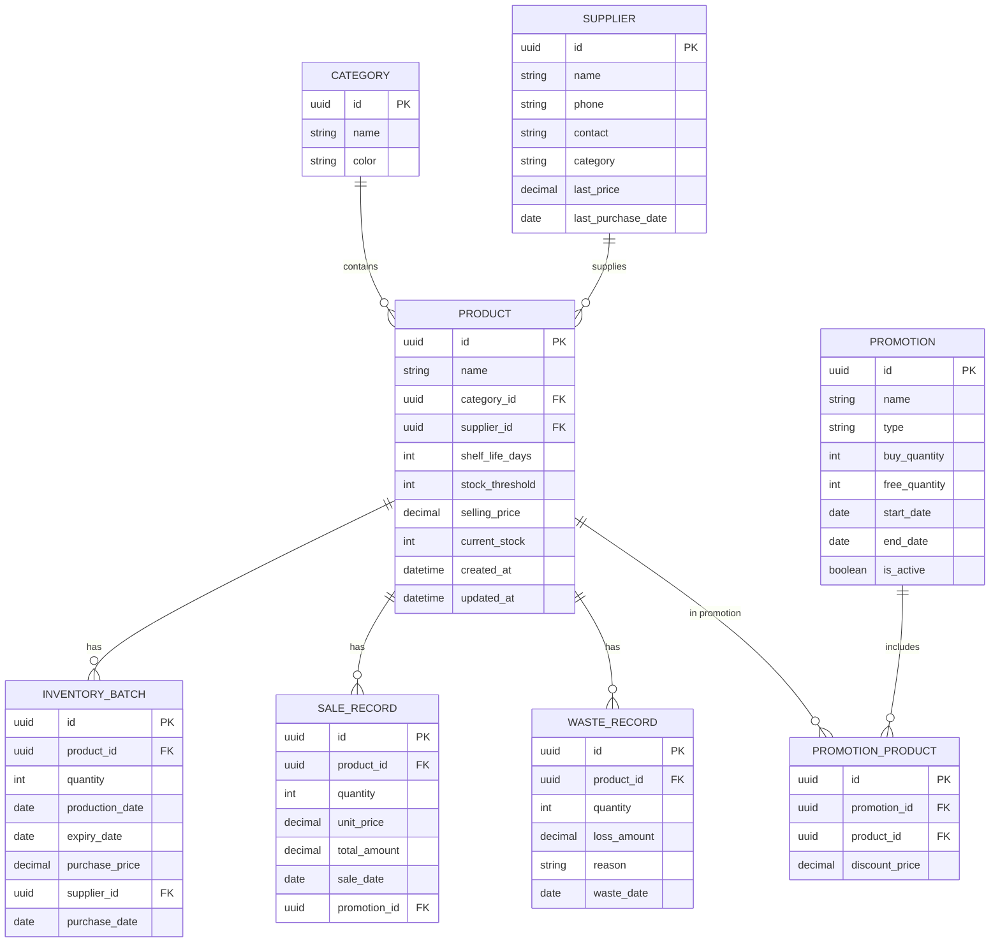

## 1. 架构设计



## 2. 技术描述

- **前端框架**：React@18 + TypeScript
- **构建工具**：Vite@5
- **样式方案**：TailwindCSS@3.4 + CSS Variables
- **UI 组件库**：shadcn/ui + Lucide React Icons
- **数据可视化**：Recharts@2
- **状态管理**：React Context + useReducer
- **本地存储**：localStorage（数据持久化）
- **路由管理**：React Router DOM@6
- **日期处理**：date-fns
- **后端**：无后端，纯前端应用，数据本地存储

## 3. 路由定义

| 路由路径 | 页面名称 | 主要功能 |
|----------|----------|----------|
| / | 首页仪表板 | 过期预警、补货提醒、快捷操作入口 |
| /products | 商品管理 | 商品CRUD、分类管理、保质期设置 |
| /inventory | 库存管理 | 入库/出库操作、批次管理、库存列表 |
| /statistics | 统计报表 | 热销排行、浪费分析、活动效果统计 |
| /suppliers | 供应商管理 | 供应商信息维护、进货价历史 |
| /promotions | 促销管理 | 活动创建、买赠规则、效果对比 |

## 4. 数据模型

### 4.1 ER 图



### 4.2 数据实体定义

```typescript
interface Category {
  id: string;
  name: string;
  color: string;
}

interface Supplier {
  id: string;
  name: string;
  phone: string;
  contact: string;
  category: string;
  lastPrice?: number;
  lastPurchaseDate?: string;
  createdAt: string;
  updatedAt: string;
}

interface Product {
  id: string;
  name: string;
  categoryId: string;
  supplierId: string;
  shelfLifeDays: number;
  stockThreshold: number;
  sellingPrice: number;
  currentStock: number;
  createdAt: string;
  updatedAt: string;
}

interface InventoryBatch {
  id: string;
  productId: string;
  quantity: number;
  productionDate: string;
  expiryDate: string;
  purchasePrice: number;
  supplierId: string;
  purchaseDate: string;
  remainingQuantity: number;
  createdAt: string;
}

interface SaleRecord {
  id: string;
  productId: string;
  quantity: number;
  unitPrice: number;
  totalAmount: number;
  saleDate: string;
  promotionId?: string;
}

interface WasteRecord {
  id: string;
  productId: string;
  quantity: number;
  lossAmount: number;
  reason: string;
  wasteDate: string;
}

interface Promotion {
  id: string;
  name: string;
  type: 'buy_one_get_one' | 'discount' | 'bundle';
  buyQuantity: number;
  freeQuantity: number;
  discountPercent?: number;
  startDate: string;
  endDate: string;
  isActive: boolean;
  productIds: string[];
}
```

## 5. 核心模块设计

### 5.1 保质期计算模块

```typescript
// 计算过期日期
function calculateExpiryDate(productionDate: string, shelfLifeDays: number): string

// 获取距离过期的天数
function getDaysUntilExpiry(expiryDate: string): number

// 获取过期状态
function getExpiryStatus(expiryDate: string): 'normal' | 'warning' | 'expired'

// 获取3天内即将过期的批次
function getExpiringBatches(days: number = 3): InventoryBatch[]
```

### 5.2 库存预警模块

```typescript
// 检查是否需要补货
function needsRestock(product: Product): boolean

// 按供应商分组的补货清单
function getRestockListBySupplier(): Map<string, Product[]>

// 计算建议补货数量
function calculateSuggestedQuantity(product: Product): number
```

### 5.3 销售统计模块

```typescript
// 获取指定月份的热销商品
function getTopSellingProducts(month: string, limit: number = 10): Array<{
  product: Product;
  quantity: number;
  revenue: number;
}>

// 获取指定月份的过期浪费统计
function getWasteStatistics(month: string): Array<{
  product: Product;
  quantity: number;
  lossAmount: number;
  category: string;
}>

// 获取每日销售趋势
function getDailySalesTrend(startDate: string, endDate: string): Array<{
  date: string;
  revenue: number;
  quantity: number;
}>
```

### 5.4 促销分析模块

```typescript
// 计算促销活动期间的销量
function getPromotionSales(promotionId: string): Array<{
  productId: string;
  quantity: number;
  revenue: number;
}>

// 对比促销前后的销量变化
function comparePromotionVsNormal(promotionId: string, productId: string): {
  promotionSales: number;
  normalSales: number;
  increasePercent: number;
}
```

## 6. 目录结构

```
src/
├── components/          # 公共组件
│   ├── ui/             # shadcn/ui 组件
│   ├── layout/         # 布局组件（Sidebar, Header等）
│   └── shared/         # 业务公共组件
├── pages/              # 页面组件
│   ├── Dashboard.tsx
│   ├── Products.tsx
│   ├── Inventory.tsx
│   ├── Statistics.tsx
│   ├── Suppliers.tsx
│   └── Promotions.tsx
├── context/            # 状态管理
│   ├── AppContext.tsx
│   └── reducers/
├── hooks/              # 自定义 Hooks
│   ├── useExpiry.ts
│   ├── useInventory.ts
│   └── useStatistics.ts
├── types/              # TypeScript 类型定义
│   └── index.ts
├── utils/              # 工具函数
│   ├── storage.ts
│   ├── dateUtils.ts
│   ├── expiryUtils.ts
│   └── mockData.ts     # 模拟数据
├── App.tsx
├── main.tsx
└── index.css
```

## 7. 初始化方案

1. 使用 Vite 初始化 React + TypeScript 项目
2. 安装并配置 TailwindCSS 3.4
3. 初始化 shadcn/ui 组件库
4. 配置 React Router DOM 路由
5. 创建 Context 状态管理
6. 生成模拟数据用于演示
7. 实现核心模块和页面
